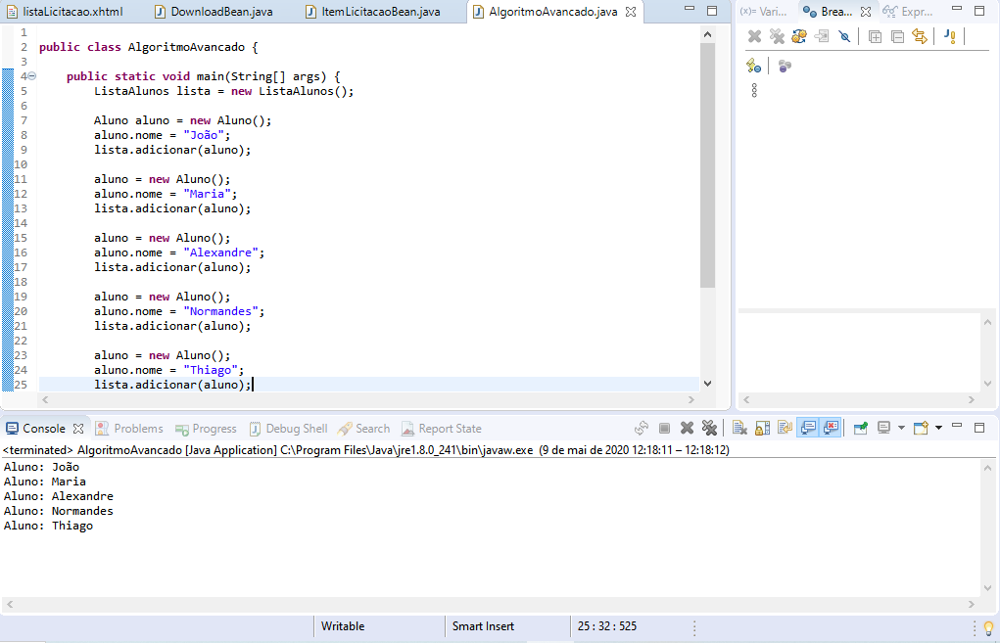

# Curso Lógica de programação com java
> Repositório dedicado a prática de exercícios propostos no curso de lógica de programação com java.

[![Build Status][travis-image]][travis-url]
[![Downloads Stats][npm-downloads]][npm-url]

Para facilitar o entendimento o repositório e dividido por pastas 
* 01-como-o-java-funciona	
* 02-Comecando	
* 03-Variaveis-E-Constantes	
* 04-Operadores	
* 05-Estruturas-De-Decisao	
* 06-Iterecao	
* 07-Vetores	
* 08-Metodos	
* 09-Programacao-Orientada-A-Objetos	
* 10-Leitura-E-Escrita-De-Dados-Em-Arquivos	
* 11-Utilizando-Codigo-De-Outros-Programadores	
* 12-Algoritmos-Avancados	
* 13-Pre-Requisitos-Para-Primeira-Aplicacao-Web	
* 14-Criando-Primeira-Aplicacao


Uma das telas do último módulo no qual é criado uma lista de contatos e é encaminhado por e-mail

## Instalação

Windows:

```sh
Instalar a IDE eclipe disponível em https://www.eclipse.org/downloads/
Clonar o projeto git clone https://github.com/andreluis7/Curso-Logica-De-Programacao-Com-Java.git
Importar projeto no eclipse e executar
```

## Exemplo de uso

Alguns exemplos podem ser utilizados para aqueles que estão começando no mundo da programação e possuem algum tipo de dificuldades.

_Para mais exemplos, consulte [https://docs.oracle.com/en/java/_ 

## Configuração para Desenvolvimento

Descreva como instalar todas as dependências para desenvolvimento e como rodar um test-suite automatizado de algum tipo. Se necessário, faça isso para múltiplas plataformas.

```sh
make install
npm test
```

## Histórico de últimos commits

* 0.3.1
    * Http
* 0.3.0
    * Pagina de cadastro
* 0.2.1
    * Listagem dos contatos
* 0.2.0
    * Configurancao dos contatos
* 0.1.1
    * Criando classes
* 0.1.0
    * Importando o projeto
* 0.0.1
    * Trabalho em andamento

## Meta

André Luís – [@andreluis7](https://www.linkedin.com/in/andr%C3%A9-lu%C3%ADs-415480116/) – adrluis7@gmail.com

Distribuído sob a licença MIT. Veja `LICENSE` para mais informações.

[https://github.com/andreluis7](https://github.com/andreluis7)

## Contributing

1. Faça o _fork_ do projeto (<https://github.com/andreluis7/Curso-Logica-De-Programacao-Com-Java/fork>)
2. Crie uma _branch_ para sua modificação (`git checkout -b feature/fooBar`)
3. Faça o _commit_ (`git commit -am 'Add some fooBar'`)
4. _Push_ (`git push origin feature/fooBar`)
5. Crie um novo _Pull Request_

[npm-image]: https://img.shields.io/npm/v/datadog-metrics.svg?style=flat-square
[npm-url]: https://npmjs.org/package/datadog-metrics
[npm-downloads]: https://img.shields.io/npm/dm/datadog-metrics.svg?style=flat-square
[travis-image]: https://img.shields.io/travis/dbader/node-datadog-metrics/master.svg?style=flat-square
[travis-url]: https://travis-ci.org/dbader/node-datadog-metrics
[wiki]: https://github.com/seunome/seuprojeto/wiki
[wiki]: https://github.com/seunome/seuprojeto/wiki
